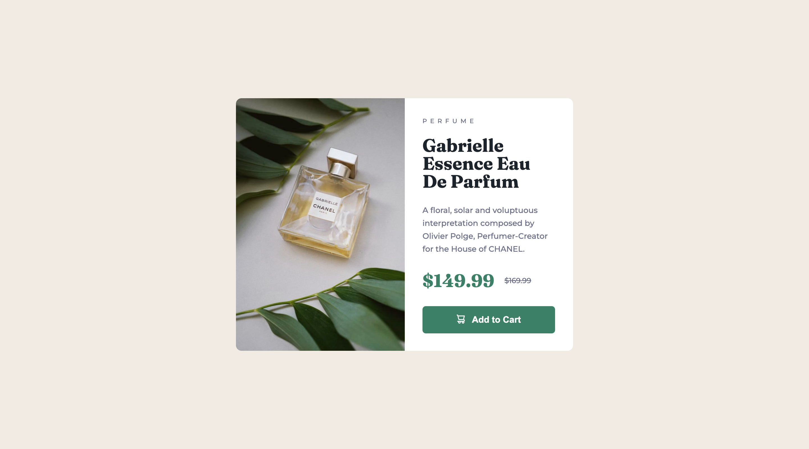

# Frontend Mentor - Product preview card component solution

This is a solution to the [Product preview card component challenge on Frontend Mentor](https://www.frontendmentor.io/challenges/product-preview-card-component-GO7UmttRfa). Frontend Mentor challenges help you improve your coding skills by building realistic projects.

## Table of contents

- [Overview](#overview)
  - [The challenge](#the-challenge)
  - [Screenshot](#screenshot)
  - [Links](#links)
- [My process](#my-process)
  - [Built with](#built-with)
  - [What I learned](#what-i-learned)
  - [Continued development](#continued-development)
  - [Useful resources](#useful-resources)
- [Author](#author)

## Overview

### The challenge

Users should be able to:

- View the optimal layout depending on their device's screen size
- See hover and focus states for interactive elements

### Screenshot

|  Mobile designed at 375px:   |  Desktop designed at 1440px:  |
| :--------------------------: | :---------------------------: |
|  |  |

### Links

- Solution URL: [https://github.com/elisilk/product-preview-card](https://github.com/elisilk/product-preview-card)
- Live Site URL: [https://elisilk.github.io/product-preview-card/](https://elisilk.github.io/product-preview-card/)

## My process

### Built with

- Semantic HTML5 markup
- CSS custom properties
- Flexbox
- Mobile-first workflow

### What I learned

- [CSS background images](https://developer.mozilla.org/en-US/docs/Web/CSS/background) - Used this to embed the product preview images in the background of the product preview container.
- [Alignments in flexbox](https://developer.mozilla.org/en-US/docs/Web/CSS/CSS_flexible_box_layout/Aligning_items_in_a_flex_container) - Continuing to learn about flexbox and how to make use of the various properties to control alignment of the flex items.

### Continued development

So much. Where to start? Definitely want to take on some more complex projects. And begin to include either a css preprocessor, multiple pages, or more JavaScript. Or maybe just more complex layouts that will need to be flexible for different screen sizes.

I'm rethinking my solution for the image in the product preview card. I used CSS background images, but the more I think about it, I think it might have been better to use an actual HTML img element that is responsive. I liked considering [this alternative solution](https://www.frontendmentor.io/solutions/mobile-first-html-css-with-flexbox-V5mSfk2iDj) that still uses CSS but has an HTML element for the image. It has a much smoother transition between screen sizes than my clunky solution, making using of flexbox very nicely. So I think combining that solution with a responsive image might work well. Worth a try.

I also like how [Dan Marius' solution](https://github.com/danmlarsen/fm-product-preview-card-component/blob/main/style.css) imports the Google Fonts directly in the CSS file. Seems much cleaner than the embed code given on the [Google Fonts site](https://fonts.google.com/). Maybe worth a try? Is there a best practice for this?

In addition to responsive images, I also want to better incorporate [more powerful techniques for fluid typography](https://www.frontendmentor.io/learning-paths/building-responsive-layouts--z1qCXVqkD/steps/669710ac85c9917334f60eb0/article/read) than what I've been doing. I have been focused on matching the design file, but there is probably a better learning result from using the more powerful techniques even if that lowers the exact match to the design.

I'm also looking more carefully at the design and trying to get a more sophisticated "design eye". Is there a box shadow behind the preview card? Even if not, it might be worth adding a subtle one anyway to just practice that.

### Useful resources

- [MDN Web Docs](https://developer.mozilla.org/en-US/docs/Web) - Of course, as always. So useful.

## Author

- Website - [Eli Silk](https://github.com/elisilk)
- Frontend Mentor - [@elisilk](https://www.frontendmentor.io/profile/elisilk)
