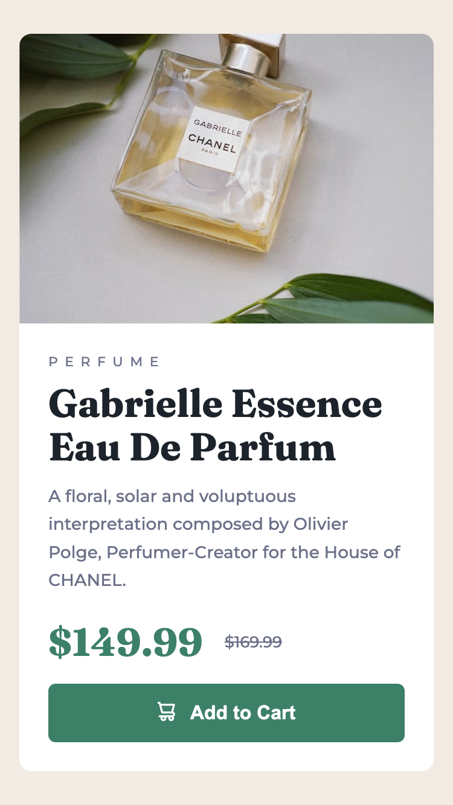

# Frontend Mentor - Product preview card component solution

This is a solution to the [Product preview card component challenge on Frontend Mentor](https://www.frontendmentor.io/challenges/product-preview-card-component-GO7UmttRfa). Frontend Mentor challenges help you improve your coding skills by building realistic projects.

## Table of contents

- [Overview](#overview)
  - [The challenge](#the-challenge)
  - [Screenshot](#screenshot)
  - [Links](#links)
- [My process](#my-process)
  - [Built with](#built-with)
  - [What I learned](#what-i-learned)
  - [Continued development](#continued-development)
  - [Useful resources](#useful-resources)
- [Author](#author)
- [Acknowledgments](#acknowledgments)

## Overview

### The challenge

Users should be able to:

- View the optimal layout depending on their device's screen size
- See hover and focus states for interactive elements

### Screenshot

|  Mobile designed at 375px:   |  Desktop designed at 1440px:  |
| :--------------------------: | :---------------------------: |
|  |  |

### Links

- Solution URL: [https://github.com/elisilk/product-preview-card](https://github.com/elisilk/product-preview-card)
- Live Site URL: [https://elisilk.github.io/product-preview-card/](https://elisilk.github.io/product-preview-card/)

## My process

### Built with

- Semantic HTML5 markup
- CSS custom properties
- Flexbox
- Mobile-first workflow

### What I learned

- [Alignments in flexbox](https://developer.mozilla.org/en-US/docs/Web/CSS/CSS_flexible_box_layout/Aligning_items_in_a_flex_container) - Continuing to learn about flexbox and how to make use of the various properties to control alignment of the flex items.
- [CSS background images](https://developer.mozilla.org/en-US/docs/Web/CSS/background) - My first draft used this method to embed the product preview images in the background of the product preview container. But after some super helpful comments/feedback, I ended implementing a different approach, which I think is much better. But still happy to have gotten some more experience with background images anyway.
- [Responsive images with the picture element](https://web.dev/learn/design/picture-element) - Putting the product images, the mobile version and the desktop version, in a `picture` element makes much more sense than the background image solution as the image is part of the content and not just decorative.
- [Using the overflow property](https://stackoverflow.com/questions/8582176/should-border-radius-clip-the-content) - I had a little trouble with the image combined with the border radius (to make the rounded borders. Originally, the [image was not clipping to the rounded edges](https://www.w3.org/TR/css-backgrounds-3/#corner-clipping), and so I had to set the container to `overflow: hidden`.
- [Using flex-basis to control the width of the image](https://developer.mozilla.org/en-US/docs/Web/CSS/CSS_flexible_box_layout/Controlling_ratios_of_flex_items_along_the_main_axis) - It wasn't obvious to me how to get the image in the desktop version of the design to have a consistent width in flexbox. It seems that the simplest option was to set the [`flex-basis` property](https://developer.mozilla.org/en-US/docs/Web/CSS/flex-basis) to the number of pixels of width for that image. This doesn't feel like a flexible solution to me, but seems to work for this case in which the box size doesn't really change. But I probably need to think about how to make that more flexible for other cases.
- [Card components](https://developer.mozilla.org/en-US/docs/Web/CSS/Layout_cookbook/Card) - Relatedly, it seems like many/most of the Frontend Mentor newbie level challenges essentially involve the creation of "cards" in different forms that you could imagine being components that are plugged into a larger webpage. So that makes me think more about what the appropriate container should be, what the appropriate heading levels are, how to name the css classes, and more. I loved [this article from Heydon Pickering on a Card component](https://inclusive-components.design/cards/) as part of his [Inclusive Components pattern library](https://inclusive-components.design/).
- [A visually-hidden `h1` element](https://www.tpgi.com/the-anatomy-of-visually-hidden/) - And then after thinking about cards and accessibility, that led me down the path of thinking about accessibility more generally. Interestingly, because I was now thinking of the card in the context of a larger webpage, it no longer seemed appropriate to use an `h1` tag for the card title. But then when I submitted my updated solution, I received the error that there was no `h1` tag. So what to do given that I still wanted my solution to match the design? That led me to suggestions about including an `h1` tag but then making it visually hidden except for screen readers. [So much](https://stackoverflow.com/questions/32265420/visually-remove-h1-element-whilst-preserving-screen-reader-accessibility-and-a) [good reading](https://benmyers.dev/blog/native-visually-hidden/) [on the topic](https://www.tpgi.com/the-anatomy-of-visually-hidden/) of [creating a `.visually-hidden` class](https://snook.ca/archives/html_and_css/hiding-content-for-accessibility). I ended up borrowing a [pre-built class](https://github.com/h5bp/html5-boilerplate/blob/main/dist/css/style.css) from the [HTML5 Boilerplate](https://html5boilerplate.com/) code.

### Continued development

So much. Where to start? Definitely want to take on some more complex projects. And begin to include either a css preprocessor, multiple pages, or more JavaScript. Or maybe just more complex layouts that will need to be flexible for different screen sizes.

I'm rethinking my solution for the image in the product preview card. I used CSS background images, but the more I think about it, I think it might have been better to use an actual HTML img element that is responsive. I liked considering [this alternative solution](https://www.frontendmentor.io/solutions/mobile-first-html-css-with-flexbox-V5mSfk2iDj) that still uses CSS but has an HTML element for the image. It has a much smoother transition between screen sizes than my clunky solution, making using of flexbox very nicely. So I think combining that solution with a responsive image might work well. Worth a try. Update: I did end up implementing this and I am MUCH happier with it.

I also like how [Dan Marius' solution](https://github.com/danmlarsen/fm-product-preview-card-component/blob/main/style.css) imports the Google Fonts directly in the CSS file. Seems much cleaner than the embed code given on the [Google Fonts site](https://fonts.google.com/). Maybe worth a try? Is there a best practice for this?

In addition to responsive images, I also want to better incorporate [more powerful techniques for fluid typography](https://www.frontendmentor.io/learning-paths/building-responsive-layouts--z1qCXVqkD/steps/669710ac85c9917334f60eb0/article/read) than what I've been doing. I have been focused on matching the design file, but there is probably a better learning result from using the more powerful techniques even if that lowers the exact match to the design.

I'm also looking more carefully at the design and trying to get a more sophisticated "design eye". Is there a box shadow behind the preview card? Even if not, it might be worth adding a subtle one anyway to just practice that.

### Useful resources

- [MDN Web Docs](https://developer.mozilla.org/en-US/docs/Web) - Of course, as always. So useful.

## Author

- Website - [Eli Silk](https://github.com/elisilk)
- Frontend Mentor - [@elisilk](https://www.frontendmentor.io/profile/elisilk)

## Acknowledgments

I am so thankful to [@DylandeBruijn](https://www.frontendmentor.io/profile/DylandeBruijn) and [@danielmrz-dev](https://www.frontendmentor.io/profile/danielmrz-dev) for taking the time to look through my code and [give me some excellent feedback and suggestions for improvement](https://www.frontendmentor.io/solutions/responsive-product-preview-card-with-background-images-hteXcg9wLQ). The ideas were super helpful and right on for improving my solution.
